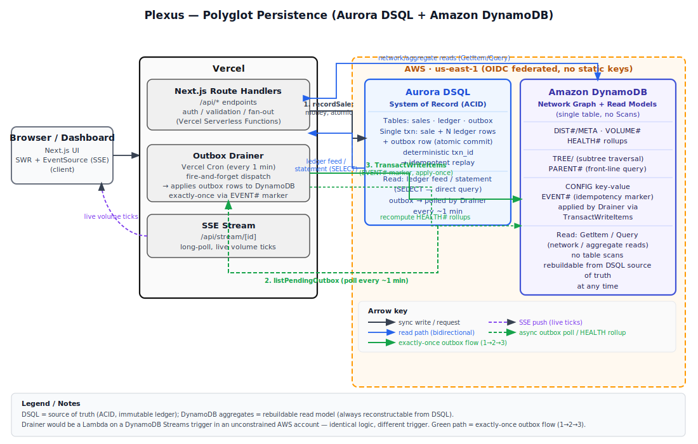

# Plexus — Real-Time Commission Engine for Direct-Sales Sellers

**Your income cockpit.** Record a retail sale, watch your upline's earnings tick in real time, see exactly where your commissions came from. Built for the individual seller who needs clarity on their numbers — not a recruiting dashboard.

**Live:** [https://plexus-commission-dashboard-f1.vercel.app](https://plexus-commission-dashboard-f1.vercel.app)  
**Vercel Team ID:** `team_mESdvS3Vca3o0a9paZo522Ok`  
**Hackathon:** [H0 — Hack the Zero Stack with Vercel v0 + AWS Databases](https://h0.vercel.app) · Track 1 — Monetizable B2C App

---

## Why Two Databases

DynamoDB owns the **network**: deep hierarchy queried by access pattern (subtree, front line, own aggregates) — single-table + materialized path serves each in O(1)/O(items), no joins, no scans; SQL recursive CTEs degrade at depth. Aurora DSQL owns the **money**: commissions must be correct under concurrency — atomic multi-row writes, strong consistency, auditable SQL (statements, joins, reconciliation); eventually-consistent counters are unacceptable for a ledger.

> Strong consistency where money requires it; access-pattern-optimized denormalized reads where the network requires it; a reliable propagation path between them.

The propagation path is a **transactional outbox**: the DSQL transaction that commits the sale and ledger rows also commits an outbox row, atomically. A drainer applies those aggregates to DynamoDB exactly-once using `TransactWriteItems` with an idempotency marker. If the drainer crashes between writes, the outbox row stays unprocessed and the next invocation retries cleanly. The DynamoDB aggregates are an eventually-consistent, **rebuildable** read model — `scripts/reconcile.ts` proves zero drift against the DSQL ledger.

---

## Architecture



**Request flow:**

1. **Browser → Vercel (Next.js Route Handlers):** the seller records a sale or loads their dashboard.
2. **Route Handler → Aurora DSQL:** `recordSale` opens a single DSQL transaction, inserts the `sales` row, all `ledger` rows (deterministic `txn_id` = `hash(saleId + beneficiaryId)` → idempotent on retry), and one `outbox` row — all atomic. This is the source of truth.
3. **Route Handler → DynamoDB** (read path): seller profile, volume aggregates, and network hierarchy are served from the single DynamoDB table with no joins and no scans.
4. **Outbox drainer → DynamoDB:** `drainOutbox()` picks up pending outbox rows and applies volume aggregates via `TransactWriteItems` with a conditional `Put` on `EVENT#<id>` as an exactly-once marker. Health rollups (`HEALTH#<period>`) are recomputed per affected subtree root after each drain batch.
5. **SSE → Browser:** the commission feed streams new ledger entries back to the dashboard in real time.

---

## Access Patterns

All 10 access patterns are served without a single DynamoDB Scan. **Rule: Zero DynamoDB Scans, anywhere.**

| # | Pattern | Store | Key / Query |
|---|---------|-------|-------------|
| 1 | Get seller profile | DynamoDB | `GetItem(PK=DIST#<id>, SK=META)` |
| 2 | Direct children (front line) | DynamoDB | `Query(PK=PARENT#<parentId>)` — `PARENT#` items |
| 3 | Full downline subtree | DynamoDB | `Query(PK=TREE, SK begins_with <node.path>)` — `TREE` items |
| 4 | Upline ancestors | In-process | Parse the materialized `path` string — zero DB calls |
| 5 | Current-period earnings / volume | DynamoDB | `GetItem(PK=DIST#<id>, SK=VOLUME#<YYYY-MM>)` |
| 6 | Network-health rollup | DynamoDB | `GetItem(PK=DIST#<id>, SK=HEALTH#<YYYY-MM>)` |
| 7 | Plan + rank thresholds | DynamoDB | `Query(PK=CONFIG)` |
| 8 | Record sale + pay upline | Aurora DSQL | Single ACID transaction: `INSERT sales` + N × `INSERT ledger` + `INSERT outbox` |
| 9 | Commission feed | Aurora DSQL | `SELECT … FROM ledger WHERE beneficiary_id=$1 ORDER BY created_at DESC` |
| 10 | Monthly statement / reconciliation | Aurora DSQL | `SELECT period, COUNT(*), SUM(amount) FROM ledger WHERE beneficiary_id=$1 AND period=$2 GROUP BY period` |

**Note on patterns 2 and 3:** the original design called for GSI1 (tree index) and GSI2 (parent index). Because the Vercel AWS Marketplace integration's IAM permissions boundary excludes `dynamodb:UpdateTable`, these are materialized as first-class items (`PK=TREE SK=<path>` and `PK=PARENT#<parentId> SK=<childId>`) instead. See [Deliberate Deviations](#deliberate-deviations).

---

## Single-Table Design & Materialized Path

The DynamoDB table (`Plexus`) holds every entity type under one PK/SK space:

| Item type | PK | SK | Key fields |
|-----------|----|----|------------|
| Seller profile | `DIST#<id>` | `META` | `name`, `email`, `parentId`, `sponsorId`, `path`, `depth`, `rank`, `status`, `plan` |
| Volume aggregate | `DIST#<id>` | `VOLUME#<YYYY-MM>` | `pv`, `gv`, `retailVolume`, `starterVolume`, `commissionEarned`, `period` |
| Health rollup | `DIST#<id>` | `HEALTH#<YYYY-MM>` | `score`, `recruitmentRatio`, `flaggedCount`, `nodes`, `flagged` |
| Tree index item | `TREE` | `<path>` | full seller record — enables `begins_with` subtree |
| Parent edge item | `PARENT#<parentId>` | `<childId>` | full seller record — direct-children lookup |
| Plan config | `CONFIG` | `PLAN` | `planType`, `levelRates[]`, `maxDepth` |
| Rank config | `CONFIG` | `RANK#<order>` | `rankName`, `minGv`, `minPv`, `order` |
| Outbox marker | `EVENT#<id>` | `APPLIED` | `appliedAt` — exactly-once idempotency guard |

**Materialized path:** every seller stores a slash-delimited path such as `001/014/207`. This one string encodes the entire upline:

- **Subtree query:** `Query(PK=TREE, SK begins_with "001/014")` — returns every descendant in O(items in subtree), no recursion.
- **Direct children:** `Query(PK=PARENT#014)` — front-line sellers in one request.
- **Upline ancestors:** `"001/014/207".split("/").slice(0, -1)` — parsed in the application layer, **zero DB calls**. This is how `recordSale` resolves every beneficiary at sale time.

---

## The Money Path & Consistency Model

```
recordSale(input)
  → getDistributor(id)            // DynamoDB GetItem — read seller + path
  → computeCommissions(path)      // pure: parse path, apply levelRates[]
  → insertSaleTxn(...)            // ONE Aurora DSQL transaction:
      BEGIN
        INSERT sales (sale_id, ...)         ON CONFLICT DO NOTHING
        INSERT ledger (txn_id, ...) × N     ON CONFLICT DO NOTHING   ← deterministic txn_id
        INSERT outbox (event_type, payload)
      COMMIT
  → drainOutbox() [fire-and-forget]
      listPendingOutbox()          // DSQL SELECT WHERE processed_at IS NULL
      for each event:
        TransactWriteItems([
          Put EVENT#<id> APPLIED   ConditionExpression: attribute_not_exists  ← idempotency
          Update DIST#<seller> VOLUME#<period> ADD pv, gv, retailVolume|starterVolume
          Update DIST#<ancestor> VOLUME#<period> ADD gv [, commissionEarned]  × N
        ])
        markOutboxProcessed(id)    // DSQL UPDATE outbox SET processed_at = now()
      recomputeHealthRollups()     // DynamoDB PutItem HEALTH#<period> per affected root
```

**Consistency model:**
- Aurora DSQL is the **source of truth**. The sale and every commission row commit atomically; partial payouts are impossible.
- `txn_id = hash(saleId + beneficiaryId)` makes the entire DSQL write **idempotent** — a retry of a crashed request inserts nothing twice (`ON CONFLICT DO NOTHING`).
- DynamoDB volume aggregates are an **eventually-consistent, rebuildable read model**. If they drift (e.g. a drain crash between apply and mark), `drainOutbox` retries safely: the `EVENT#<id>` conditional `Put` causes `TransactionCanceledException` with `ConditionalCheckFailed`, which the drainer treats as "already applied."
- `scripts/reconcile.ts` compares DSQL `SUM(amount) GROUP BY beneficiary_id, period` against DynamoDB `commissionEarned` for every seller-period pair and exits non-zero on any discrepancy > $0.01. Post-seed reconcile shows **zero drift across 36 beneficiary-periods**.

**Acceptance gates passed:**
- Phase B (7/7): seed reconcile, DSQL rollback atomicity, idempotency, 5-level cascade correctness, statement-vs-feed match, API gating, final reconcile.
- Phase C (5/5): outbox commits atomically with money, crash-survival + exactly-once DynamoDB apply, health rollup, graceful degradation, Phase-B invariants hold post-outbox-propagation.

---

## Deliberate Deviations

These constraints are real; naming them is part of the story.

### (a) TREE / PARENT# items instead of GSI1 / GSI2

The Vercel AWS Marketplace integration provisions a least-privilege IAM role. `DescribeTable`, `GetItem`, `Query`, `PutItem`, `UpdateItem`, `TransactWriteItems` are all allowed. `dynamodb:UpdateTable` is **excluded by the permissions boundary** — the same reason enabling DynamoDB Streams failed. Verified:

```
AccessDeniedException: User: arn:aws:sts::478728046454:assumed-role/access-dynamodb-lime-engine/...
is not authorized to perform: dynamodb:UpdateTable on resource:
arn:aws:dynamodb:us-east-1:478728046454:table/aws-dynamodb-lime-engine
because no permissions boundary allows the dynamodb:UpdateTable action
```

Resolution: the same subtree and front-line access patterns are served by first-class `TREE` and `PARENT#` items written at seed/insert time. No access-pattern capability is lost; only the storage approach differs. See `lib/server/dynamo.ts` key builders and `docs/notes/streams-lambda-attempt.md`.

### (b) Aurora DSQL DDL adaptations

DSQL is distributed-SQL, not vanilla PostgreSQL. The schema adapts accordingly:

| Spec DDL | DSQL reality |
|----------|--------------|
| `FOREIGN KEY (sale_id) REFERENCES sales` | Not supported → enforced in application layer |
| `BIGINT GENERATED ALWAYS AS IDENTITY` (outbox PK) | Not supported → `UUID DEFAULT gen_random_uuid()` |
| `CREATE INDEX … (beneficiary_id, created_at DESC)` | `DESC` on index keys not supported → `CREATE INDEX ASYNC … (beneficiary_id, created_at)` |
| Synchronous `CREATE INDEX` | Not supported → `CREATE INDEX ASYNC` |

### (c) Vercel Cron instead of Lambda + DynamoDB Streams

The spec called for an AWS Lambda triggered by DynamoDB Streams as the outbox drainer. Enabling Streams requires `dynamodb:UpdateTable` — blocked by the same IAM boundary as (a). The architecture is **unchanged**: `drainOutbox()` in `lib/server/engine.ts` is the unit of work regardless of how it is triggered. The **real-time** propagation is an inline fire-and-forget `drainOutbox()` after each sale (and because the drainer processes *all* pending outbox rows, every sale also sweeps anything a prior crash left behind). A Vercel Cron job (`vercel.json`) is a secondary crash-sweeper for quiet periods — scheduled daily (`0 0 * * *`) because Hobby-tier accounts only permit daily crons; on a Pro team it can run every minute. Replacing the trigger with a Lambda behind Streams or SQS would be a deployment change, not a code change.

> In an unconstrained AWS account the drainer is a Lambda on a Streams trigger; under the marketplace integration's least-privilege IAM boundary (no `UpdateTable`), the identical outbox drainer runs as a scheduled Vercel function. The exactly-once guarantee lives in the application logic, not the trigger.

---

## Monetization

Plexus is freemium. The commission engine always pays all 5 upline levels for every seller — gating is view-only, enforced at the API layer (gated endpoints return `{ gated: true }` with HTTP 402 for Free users). A mock upgrade (`POST /api/billing/upgrade`) flips the `plan` field on the seller's `META` item and takes effect immediately with no reload.

| Feature | Free | Pro ($12/mo) |
|---------|------|--------------|
| Dashboard (PV / GV / Rank / Earnings) | Yes | Yes |
| Record a sale | Yes | Yes |
| Live commission feed | Yes | Yes |
| Network tree — levels 1–3 | Yes | Yes |
| Network tree — full depth | — | Yes |
| Network Health analytics | Teaser only | Full score + heatmap |

---

## Local Setup

**Prerequisites:** Node.js 24+, pnpm, a Vercel project linked to this repo with the AWS Databases marketplace integration (provisions DynamoDB + Aurora DSQL over OIDC — no static AWS credentials in the repo).

```bash
# 1. Pull environment variables (OIDC token, DSQL endpoint, DynamoDB table name)
vercel env pull .env.local

# 2. Install dependencies
pnpm install

# 3. Create Aurora DSQL tables (idempotent — IF NOT EXISTS)
pnpm exec tsx scripts/dsql-schema.ts

# 4. Seed both stores
#    Option A: HTTP (app must be running)
curl -X POST http://localhost:3000/api/seed \
     -H "x-seed-token: $SEED_TOKEN"
#    Option B: direct script (no running server needed)
pnpm exec tsx scripts/reseed.ts

# 5. Start the dev server
pnpm dev
```

**OIDC token note:** the Vercel OIDC token that backs the AWS credentials expires after approximately 12 hours. If you see `ExpiredTokenException`, run `vercel env pull .env.local` again to refresh.

---

## Scripts & Tests

| Script | Purpose |
|--------|---------|
| `pnpm exec tsx scripts/dsql-schema.ts` | Create DSQL tables and async indexes (idempotent) |
| `pnpm exec tsx scripts/reconcile.ts` | Compare DSQL ledger sums vs DynamoDB `commissionEarned` aggregates; exits non-zero on drift > $0.01 |
| `pnpm exec tsx scripts/acceptance-p2.ts` | Phase-B gate: 7 checks covering seed, atomicity, idempotency, cascade correctness, statement/feed, API gating, final reconcile |
| `pnpm exec tsx scripts/acceptance-p3.ts` | Phase-C gate: 5 checks covering outbox atomicity, crash-survival, exactly-once apply, health rollup, Phase-B invariants post-propagation |
| `pnpm test` | 19 Vitest unit tests (commission math, ledger mapping, outbox payload, rank thresholds) |

---

## License

MIT — see `LICENSE`.
